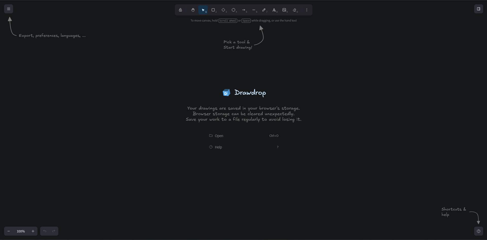

  

<h1 align="center">Drawdrop</h1>

  

  

## Description

Drawdrop is built on top of [Excalidraw](https://excalidraw.com). It keeps the same simple, hand-drawn whiteboard, then adds a dashboard and **cloud storage** so your boards live beyond the current browser tab.

The problem it tries to solve is the gap between a great free canvas and actually keeping your work. Many tools either stay local-only or charge a lot once you want boards in the cloud. Drawdrop aims to stay generous and cheap and **COMPLEATELY OPENSOURCE**:

- **Free**, with a limit — at least **3 boards** stored in the cloud at no cost
- **Much lower prices** if you need more board storage

Right now, drawings are still saved locally in the browser. A backend with accounts, a dashboard, and cloud storage is next. Until then, save your work to a file regularly so it does not disappear if browser storage is cleared.

I am actively working on this project. Drawdrop is still in **beta**.

## Tech stack

### Current

- **TypeScript** and **React**
- **Vite** for build and development
- **client-side** storage (browser local storage)

### Upcoming

- **Java** + **Spring Boot** for the backend
- **PostgreSQL** for the database
- **Cloudflare R2** for file storage
